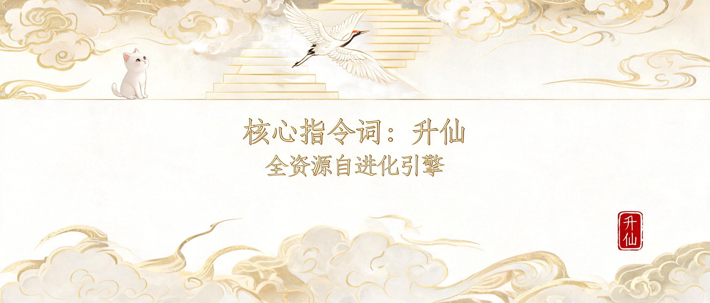

# 升仙 · 全资源自进化引擎 — 千面启动→全盘扫描→水桶分析→化神评分门控→委托修复→凝魂结晶

> Miao Agent 核心指令词 · v1.4 | 浅色国潮磨砂品牌视觉



## 是什么

全资源自进化引擎 — 千面启动→全盘扫描→水桶分析→化神评分门控→委托修复→凝魂结晶

## 用法

```
升仙 {目标/指令}
```

## 触发词

进化 / 升仙

## 原创声明

本项目为原创沉淀(本库自研方法论), 无外部开源借鉴。


## 说明

- 完整指令词本体: [SKILL.md](SKILL.md)
- 本图为示意横幅(出图优化迭代中)
